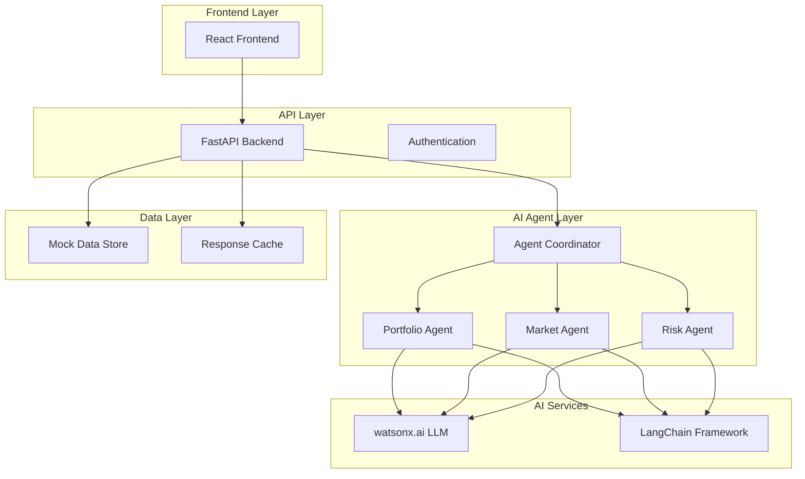
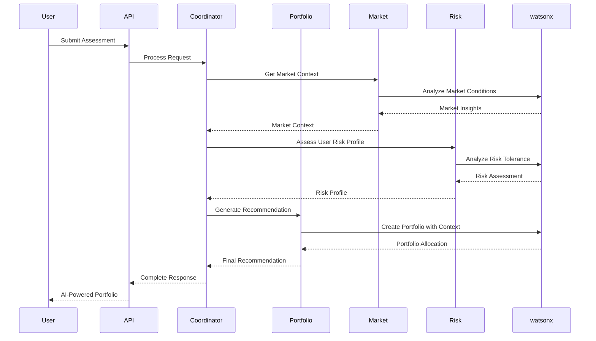

# Design Document

## Overview

This design transforms the existing FastAPI portfolio advisor into an AI-powered system using IBM watsonx.ai and LangChain agents. The architecture prioritizes hackathon success by focusing on impressive demo features while maintaining system reliability through graceful fallbacks.

The system will use a multi-agent architecture where specialized AI agents handle different aspects of portfolio management: analysis, market commentary, and risk assessment. This approach showcases advanced AI capabilities while keeping individual components manageable.

## Architecture

### High-Level Architecture



### Agent Communication Flow



## Components and Interfaces

### 1. Agent Coordinator (`agents/coordinator.py`)

**Purpose**: Orchestrates communication between specialized agents and manages the overall workflow.

**Key Methods**:
- `process_portfolio_request(assessment_data)`: Main entry point for portfolio generation
- `coordinate_agents(context)`: Manages agent communication and data flow
- `handle_fallback(error)`: Graceful degradation when AI services fail

**Interfaces**:
```python
class AgentCoordinator:
    def __init__(self, llm: ChatWatsonx):
        self.portfolio_agent = PortfolioAgent(llm)
        self.market_agent = MarketAgent(llm)
        self.risk_agent = RiskAgent(llm)
    
    async def process_portfolio_request(self, assessment: AssessmentData) -> PortfolioRecommendation:
        # Coordinate multi-agent workflow
        pass
```

### 2. Portfolio Agent (`agents/portfolio_agent.py`)

**Purpose**: Generates personalized portfolio allocations using AI analysis.

**Key Responsibilities**:
- Analyze user financial profile and goals
- Generate asset allocation recommendations
- Provide rationale for each allocation decision
- Calculate expected returns and risk metrics

**AI Prompts**: Uses structured prompts to ensure consistent, professional portfolio recommendations.

### 3. Market Agent (`agents/market_agent.py`)

**Purpose**: Provides market context and commentary for portfolio decisions.

**Key Responsibilities**:
- Analyze current market conditions
- Generate market outlook commentary
- Identify sector opportunities and risks
- Provide economic context for recommendations

### 4. Risk Agent (`agents/risk_agent.py`)

**Purpose**: Performs advanced risk analysis and generates risk-aware insights.

**Key Responsibilities**:
- Assess user risk tolerance and capacity
- Identify portfolio concentration risks
- Generate scenario-based risk projections
- Explain risk metrics in plain language

### 5. watsonx Integration Layer (`services/watsonx_service.py`)

**Purpose**: Manages watsonx.ai connections and provides fallback mechanisms.

**Key Features**:
- Connection pooling and retry logic
- Graceful fallback to mock responses
- Cost optimization through model selection
- Response caching for demo reliability

## Data Models

### Enhanced Portfolio Response

```python
class AIPortfolioRecommendation(BaseModel):
    allocation: List[PortfolioAllocation]
    expected_return: float
    volatility: float
    sharpe_ratio: float
    risk_score: float
    confidence: int
    
    # AI-generated content
    market_commentary: str
    allocation_rationale: Dict[str, str]
    risk_analysis: str
    key_assumptions: List[str]
    
    # Agent metadata
    generated_by: str
    processing_time: float
    model_version: str
```

### Agent Context

```python
class AgentContext(BaseModel):
    user_assessment: AssessmentData
    market_conditions: Dict[str, Any]
    risk_profile: Dict[str, Any]
    timestamp: datetime
    session_id: str
```

## Error Handling

### Fallback Strategy

1. **Primary**: watsonx.ai generates all AI content
2. **Secondary**: Use cached AI responses for similar profiles
3. **Tertiary**: Enhanced mock responses with AI-like formatting
4. **Final**: Original mock system

### Error Recovery

```python
class AIServiceManager:
    async def generate_with_fallback(self, prompt: str, context: dict) -> str:
        try:
            return await self.watsonx_generate(prompt, context)
        except WatsonxConnectionError:
            return await self.get_cached_response(prompt, context)
        except Exception:
            return self.generate_mock_response(context)
```

## Testing Strategy

### Demo Reliability Tests

1. **Connection Tests**: Verify watsonx.ai connectivity and fallback behavior
2. **Performance Tests**: Ensure sub-10-second response times
3. **Content Quality Tests**: Validate AI-generated content meets standards
4. **Edge Case Tests**: Handle invalid inputs gracefully

### Hackathon-Specific Testing

1. **Demo Scenario Tests**: Pre-test common demo scenarios
2. **Fallback Tests**: Ensure system works without internet/AI
3. **Judge Impression Tests**: Verify impressive features work consistently

### Test Data

Create realistic test scenarios that showcase AI capabilities:
- Conservative investor (age 55, risk tolerance 3)
- Aggressive young investor (age 25, risk tolerance 9)
- Moderate investor with ESG preferences
- High-net-worth investor with complex goals

## Implementation Priorities for Hackathon Success

### Phase 1: Core AI Integration (Highest Priority)
- watsonx.ai connection and authentication
- Single portfolio agent with basic AI generation
- Fallback mechanism to mock responses

### Phase 2: Multi-Agent Architecture (High Priority)
- Agent coordinator implementation
- Market and risk agents
- Enhanced AI-generated content

### Phase 3: Demo Polish (Medium Priority)
- Response caching for reliability
- Enhanced error messages
- Performance optimization

### Phase 4: Advanced Features (Nice-to-Have)
- Real-time market data integration
- Advanced risk modeling
- Personalization learning

## Security Considerations

- Store watsonx.ai credentials securely in environment variables
- Implement rate limiting to prevent API quota exhaustion
- Sanitize user inputs before sending to AI models
- Cache responses to reduce API calls during demos

## Performance Optimization

- Use async/await for all AI service calls
- Implement response caching with 1-hour TTL
- Pre-warm AI models during system startup
- Use connection pooling for watsonx.ai API calls

## Demo Strategy

### Key Demo Points
1. **AI-Powered Analysis**: Show real-time AI reasoning process
2. **Multi-Agent Coordination**: Demonstrate different agents working together
3. **Intelligent Explanations**: Highlight AI-generated rationales and commentary
4. **Graceful Fallbacks**: Show system reliability even with connectivity issues

### Success Metrics
- Portfolio generation in <10 seconds
- 3+ distinct AI features working
- Professional-quality AI-generated content
- Zero crashes during demo scenarios